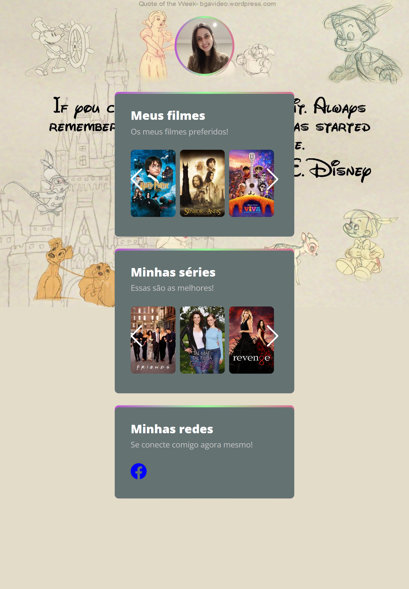

# Favoritos

Projeto construído para treinar tudo o que foi aprendido no evento NLW da Rocketseat.

[ 🔗 Clique aqui para acessar](https://alinelourenco.github.io/favoritos/)

## 💻 Tecnologias
- HTML
- CSS
- Javascript

## O que aprendi:
Aprendi a usar a biblioteca Swiper.

## 👩🏻‍💻 Contato

alinelaurentius@gmail.com

